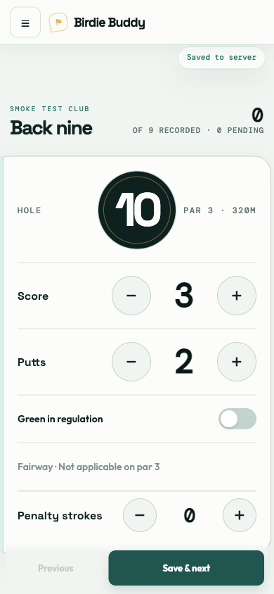
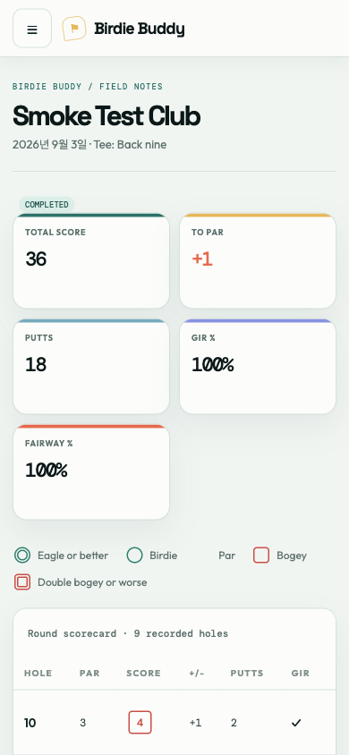
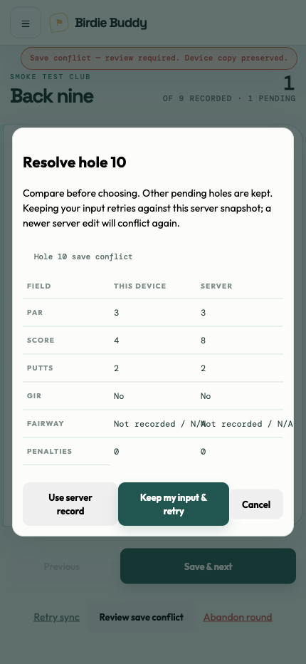
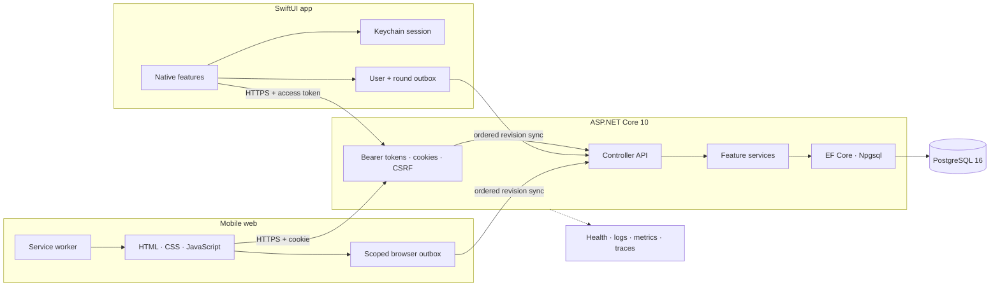

# BirdieBuddy

<p align="center">
  
</p>

<p align="center">
  <strong>Reliable golf scoring, from the first tee to the final sync.</strong>
</p>

<p align="center">
  Record 9- and 18-hole rounds, recover safely from poor connectivity, understand your game, and turn results into focused practice.
</p>

<p align="center">
  <a href="https://github.com/Kouen-Park/BirdieBuddy/actions/workflows/ci.yml"></a>
  
  
  
</p>

BirdieBuddy is a golf scorecard platform with a native SwiftUI client, a mobile-first web experience, and an ASP.NET Core API. Its defining principle is simple: a golfer's input must not disappear just because the connection does.

## Current status

The product is ready for active iOS development and internal testing, but it is not yet App Store ready.

| Surface | Status | Current coverage |
|---|---|---|
| iOS app | Active development | Token authentication, courses, round drafts, live scoring, local outbox, conflict review, history, statistics, practice, and account tools |
| Mobile web | Beta-capable | Full round lifecycle, offline recovery, detailed statistics, practice guidance, course management, and account flows |
| Backend API | Operational foundation | ASP.NET Core 10, PostgreSQL, ownership checks, mobile and browser authentication, rate limits, health checks, and telemetry |
| Release operations | In progress | Physical-device verification, TestFlight, production SMTP, backup rehearsal, monitoring, privacy, and store metadata remain |

## Product experience

### Play the round

- Start a 9- or 18-hole draft from a course and tee.
- Record score, putts, GIR, fairway, and penalties with fast per-hole controls.
- Resume, complete, abandon, edit, or review a round without losing its lifecycle state.

### Keep every change safe

- Persist input locally before reporting it as device-saved.
- Isolate pending writes by user and round.
- Synchronize queued hole revisions in order when connectivity returns.
- Stop on a `409` and let the golfer compare device and server values instead of silently overwriting either one.

### Learn and improve

- Compare score-to-par across 9- and 18-hole rounds.
- Review GIR, fairway, putting, par-type, and trend data.
- Turn recent completed rounds into evidence-linked practice recommendations and sessions.

## Screenshots

<table>
  <tr>
    <td align="center"><strong>Live scorecard</strong></td>
    <td align="center"><strong>Round review</strong></td>
    <td align="center"><strong>Conflict recovery</strong></td>
  </tr>
  <tr>
    <td></td>
    <td></td>
    <td></td>
  </tr>
</table>

> These web screenshots use deterministic local fixtures. Native iPhone screenshots will replace or complement them after the first TestFlight design pass.

## Architecture

The backend remains a modular monolith. Both clients share the same PostgreSQL source of truth while using authentication and local persistence appropriate to their platform.



### Mobile session lifecycle

The iOS app receives a short-lived access token and a rotating refresh token. Tokens are stored in Keychain, refresh is single-use, and logout or account security changes revoke the mobile session. Browser cookie authentication remains available without breaking existing web clients.

### Live-save lifecycle

```text
input changes
  -> persist a user-and-round-scoped local revision
  -> show the device-saved state
  -> send the expected server snapshot and new value
  -> acknowledge only the matching local revision
     or preserve it and open explicit conflict review
```

## Technology

| Layer | Technology |
|---|---|
| Native client | SwiftUI, Swift concurrency, URLSession, Keychain, file-backed actor outbox |
| Web client | Semantic HTML, CSS, vanilla JavaScript, Service Worker, Web Locks, Chart.js |
| Backend | ASP.NET Core 10, C# controllers and scoped services |
| Data | EF Core 10, Npgsql, PostgreSQL 16 |
| Security | Cookie + CSRF browser sessions, rotating bearer-token mobile sessions, ownership-aware queries, rate limiting |
| Observability | OpenTelemetry, structured logs, liveness and readiness checks |
| Tests | XCTest, xUnit, PostgreSQL integration tests, Node test runner, Playwright |
| Delivery | GitHub Actions, Docker, Render |

## Run the backend and web app

### Prerequisites

- .NET 10 SDK
- PostgreSQL 16
- Node.js 22+ and npm for browser tests

Configure a local database with .NET Secret Manager:

```bash
dotnet user-secrets set "ConnectionStrings:DefaultConnection" \
  "Host=localhost;Port=5432;Database=birdiebuddy;Username=YOUR_USER;Password=YOUR_PASSWORD"
dotnet restore
dotnet run
```

Open the HTTPS URL printed by ASP.NET Core. Swagger is available at `/swagger` in Development. Never commit working credentials to `appsettings*.json`.

## Run the iOS app

### Prerequisites

- Xcode 16 or later
- An iOS 17+ simulator or device
- A running BirdieBuddy API

Open `ios/BirdieBuddyApp.xcodeproj`. Debug builds default to `http://localhost:5000`, while Release builds use the production HTTPS origin configured by the target's `API_BASE_URL` build setting. A scheme environment variable with the same name can override either value for local or staging runs. Release configuration rejects HTTP and localhost endpoints. The native client intentionally has no third-party dependencies.

Run its test suite from Xcode or the command line:

```bash
./scripts/test-ios.sh
```

The script selects an iPhone from the newest installed simulator runtime. Set `BIRDIEBUDDY_IOS_SIMULATOR_ID` to use a specific simulator UDID.

## Test the platform

```bash
# .NET unit, API, and service tests
dotnet test tests/BirdieBuddy.Tests/BirdieBuddy.Tests.csproj

# Browser-module tests
npm ci
npm run test:browser

# Deterministic mobile-browser journey
npx playwright install chromium
npm run test:e2e:fixture

# Native iOS tests
./scripts/test-ios.sh
```

CI additionally runs PostgreSQL integration tests, full browser E2E, migration SQL generation, publish and Docker validation, and the SwiftUI test target on Xcode 26.5.

## Repository map

| Path | Purpose |
|---|---|
| `ios/BirdieBuddyApp/` | SwiftUI application, networking, authentication, local persistence, and features |
| `ios/BirdieBuddyAppTests/` | Native model and outbox tests |
| `Controllers/` | HTTP endpoints and status-code mapping |
| `Services/` | Authentication, courses, rounds, statistics, practice, and imports |
| `DTOs/` | Validated public request and response contracts |
| `Infrastructure/` | Errors, security, observability, and deployment validation |
| `Data/`, `Models/`, `Migrations/` | EF Core persistence and PostgreSQL schema history |
| `wwwroot/` | Mobile web UI, service worker, local outbox, and static assets |
| `tests/` | .NET, browser-module, fixture, and Playwright coverage |
| `scripts/` | iOS test selection, deployment checks, SMTP probe, backup rehearsal, and source data tools |

## Roadmap

### 1. Harden the native core — implemented, awaiting device gate

- SwiftData now persists user-scoped pending writes and conflict review state across app termination.
- App-wide synchronization resumes after session restoration, reauthentication, network recovery, foreground entry, and live-round entry.
- Retryable failures remain queued, conflicts pause only their round, and permanent client failures require explicit attention.
- XCTest covers migration, revision de-duplication, account isolation/deletion, conflict restoration, network recovery, and permanent client errors.

### 2. Reach deliberate web parity

- Add round pagination, filters, editing, and richer statistics to iOS.
- Complete password change, email verification/reset, custom course, and tee workflows.
- Compare web and native results against shared API contract fixtures.

### 3. Validate on real iPhones

- Test an entire round through airplane mode, relaunch, backgrounding, and Wi-Fi/cellular transitions.
- Verify iPhone SE-sized layouts, keyboard avoidance, safe areas, Dynamic Type, VoiceOver, and low-power mode.
- Run internal TestFlight with instrumentation for starts, completions, sync failures, and conflict rates.

### 4. Prepare production and App Store release

- Separate development, staging, and production API configuration.
- Finish SMTP verification, backup restore rehearsal, monitoring, crash reporting, and migration rollout procedures.
- Prepare privacy policy, terms, App Privacy answers, screenshots, reviewer credentials, and store metadata.
- Complete external TestFlight before App Store submission.

Shot-by-shot tracking, social features, coach sharing, and payments remain outside the first native release.

## Documentation

- [Architecture](docs/architecture.md)
- [Native mobile API contract](docs/mobile-api.md)
- [iOS client guide](ios/README.md)
- [Testing and CI](docs/testing.md)
- [iOS release checklist](docs/ios-release.md)
- [Beta operations](docs/beta-operations.md)
- [Physical iPhone Safari checklist](tests/browser/iphone-safari-checklist.md)
