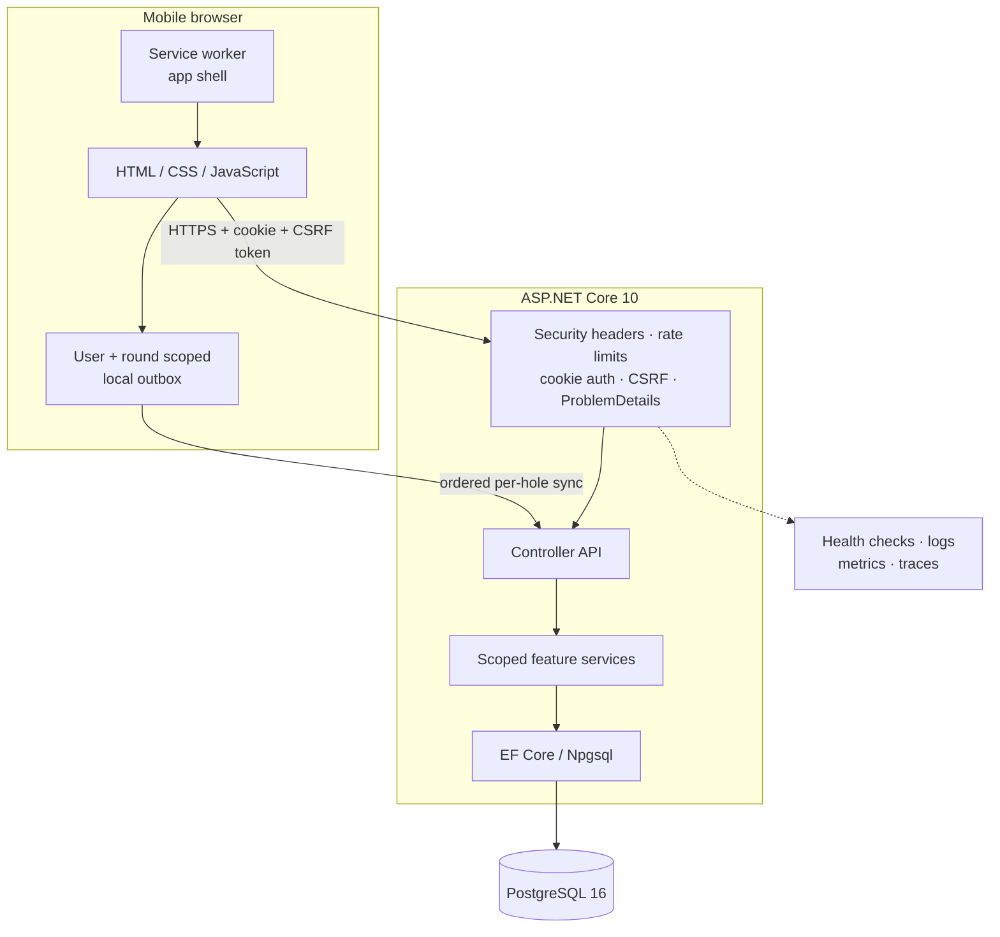

# Birdie Buddy

<p align="center">
  
</p>

<p align="center">
  <strong>A mobile-first golf scorecard that keeps working when the course connection does not.</strong>
</p>

<p align="center">
  Track 9- and 18-hole rounds, review performance trends, and turn recent results into focused practice.
</p>

Birdie Buddy is an English-language mobile web app built for a small beta. Its core design goal is reliable round completion and recovery in poor-connectivity conditions: input is saved to a user-and-round-scoped browser outbox before it is synchronized with PostgreSQL.

## Screenshots

<table>
  <tr>
    <td align="center"><strong>Live scorecard</strong></td>
    <td align="center"><strong>Round review</strong></td>
    <td align="center"><strong>Conflict recovery</strong></td>
  </tr>
  <tr>
    <td></td>
    <td></td>
    <td></td>
  </tr>
  <tr>
    <td>Fast per-hole score, putt, GIR, fairway, and penalty entry.</td>
    <td>Score-to-par summary, key rates, and editable hole history.</td>
    <td>Explicit device-versus-server comparison without silently discarding input.</td>
  </tr>
</table>

> Screenshots use the repository's deterministic local fixture and sample data.

## Key features

- **Resilient live rounds** — draft, autosave, offline queue, resume, complete, and abandon flows for 9 or 18 holes.
- **Safe conflict handling** — per-hole optimistic concurrency with a review screen for choosing the device or server value.
- **Round history** — completed scorecards, pagination, per-hole breakdowns, and guarded edit/delete operations.
- **Useful statistics** — comparable 9/18-hole scoring, score-to-par, GIR, fairway, putting, and recent trend views.
- **Practice guidance** — evidence-linked priorities and measurable drills derived from valid completed rounds.
- **Guest browsing** — the home page and shared course catalogue are available without creating an account.
- **Course catalogue** — shared Golf New Zealand course data alongside member-owned custom courses and tees.
- **Private accounts** — cookie sessions, profile and password management, email verification/recovery, data export, and account deletion.
- **Production foundations** — CSRF protection, rate limiting, security headers, health checks, structured telemetry, migration locking, and CI.

## Tech stack

| Layer | Technology | Role |
|---|---|---|
| Backend | ASP.NET Core 10, C# | Static hosting, controller API, authentication, middleware, health checks |
| Data | EF Core 10, Npgsql, PostgreSQL 16 | Relational persistence, migrations, constraints, ownership-aware queries |
| Frontend | HTML, CSS, vanilla JavaScript | Mobile-first UI served directly from `wwwroot`; no frontend build step |
| Offline | Service Worker, `localStorage`, Web Locks | App-shell caching, scoped outbox, and multi-tab synchronization |
| Charts | Chart.js 4.4.4 | Self-hosted score, GIR, and putting visualizations |
| Observability | OpenTelemetry, ASP.NET Core health checks | Traces, metrics, logs, liveness, and database readiness |
| Testing | xUnit, WebApplicationFactory, Node test runner, Playwright | Unit, HTTP pipeline, PostgreSQL integration, browser-module, and mobile E2E coverage |
| Delivery | Docker, GitHub Actions, Render | Release build, container validation, migration artifact, and deployment smoke checks |

## Architecture

Birdie Buddy is a modular monolith: one ASP.NET Core process serves both the static client and the authenticated API. PostgreSQL is the durable source of truth; browser storage improves live-round resilience but is not treated as a backup.



The controller-facing `IRoundService` remains stable while round behavior is separated by responsibility:

| Component | Responsibility |
|---|---|
| `RoundService` | Thin compatibility facade used by controllers |
| `RoundQueryService` | Lists, selectors, pagination, and detail reads |
| `LiveRoundService` | Draft creation and live per-hole writes |
| `RoundLifecycleService` | Completed-scorecard creation, completion, and abandonment |
| `CompletedRoundEditor` | Completed-round metadata/hole edits and deletion |
| `RoundRules` | Shared validation, tee resolution, expected-hole rules, and DTO mapping |

Every feature service is scoped to the request's `ApplicationDbContext` and current user. Ownership is enforced in service queries rather than inferred from browser-submitted IDs. See [the architecture guide](docs/architecture.md) for request ordering, data boundaries, concurrency, offline behavior, and scaling limits.

### Live-save lifecycle

```text
input changes
  -> persist a local outbox revision
  -> show device-saved state
  -> verify the signed-in account
  -> send the expected server snapshot + new value
  -> acknowledge and remove only that revision
     or preserve it and show an explicit 409 conflict review
```

New input remains queued while a request is in flight. Completion is blocked until every expected hole is valid and the local outbox has synchronized.

## Run locally

### Prerequisites

- .NET 10 SDK
- PostgreSQL 16
- Node.js 22+ and npm for browser and Playwright tests

Configure a development database with .NET Secret Manager, then start the app:

```bash
dotnet user-secrets set "ConnectionStrings:DefaultConnection" \
  "Host=localhost;Port=5432;Database=birdiebuddy;Username=YOUR_USER;Password=YOUR_PASSWORD"
dotnet restore
dotnet run
```

Open the HTTPS URL printed by ASP.NET Core. Swagger is available at `/swagger` in Development. Pending migrations run at startup under a PostgreSQL advisory lock.

Never commit a working connection string or deployment credential to `appsettings*.json`.

## Tests

```bash
# .NET unit and HTTP pipeline tests
dotnet test tests/BirdieBuddy.Tests/BirdieBuddy.Tests.csproj

# Browser-module tests
npm ci
npm run test:browser

# Deterministic mobile Chromium fixture
npx playwright install chromium
npm run test:e2e:fixture
```

PostgreSQL integration and full application E2E tests require explicitly named disposable databases. The exact safeguards, environment variables, CI jobs, and artifact locations are documented in [docs/testing.md](docs/testing.md).

## Repository layout

| Path | Purpose |
|---|---|
| `Controllers/` | HTTP endpoints and status-code mapping |
| `DTOs/` | Validated browser-facing request and response contracts |
| `Services/` | Authentication, courses, round workflows, statistics, practice, and imports |
| `Infrastructure/` | Error handling, security, observability, and deployment validation |
| `Data/`, `Models/`, `Migrations/` | EF Core context, entities, and PostgreSQL schema history |
| `wwwroot/` | Static mobile UI, service worker, local outbox, and self-hosted assets |
| `tests/BirdieBuddy.Tests/` | Unit, HTTP pipeline, and PostgreSQL integration tests |
| `tests/browser/`, `tests/e2e/` | JavaScript regression tests, fixtures, and Playwright journeys |
| `scripts/` | Deployment checks, SMTP probe, backup rehearsal, and Golf NZ source data |

## Configuration

ASP.NET Core environment variables use double underscores for nested keys. The essential production settings are:

| Variable | Required | Purpose |
|---|---:|---|
| `ConnectionStrings__DefaultConnection` | Yes | Npgsql connection string |
| `ASPNETCORE_ENVIRONMENT` | Hosted | Set to `Production` when deployed |
| `Application__PublicBaseUrl` | Email flows | HTTPS origin for verification and reset links |
| `Authentication__RequireVerifiedEmail` | No | Enforce verified-email login; defaults to `false` |
| `Email__From`, `Email__Smtp__Host` | Email flows | Sender and SMTP host; they must be configured together |
| `Administration__ImportKey` | Admin operations | Secret accepted through `X-Admin-Key` |
| `DataProtection__KeyRingPath` | Multi-instance | Persistent shared cookie-encryption key directory |
| `OTEL_EXPORTER_OTLP_ENDPOINT` | Observability | Optional OTLP destination |

Production validates database, HTTPS URL, SMTP pairing, and migration policy before serving traffic. See [beta operations](docs/beta-operations.md) for the complete Render configuration, backup rehearsal, monitoring, and release checklist.

## Documentation

- [Architecture](docs/architecture.md) — request pipeline, authentication, ownership, round boundaries, offline state, and scaling limits
- [Testing and CI](docs/testing.md) — test layers, local PostgreSQL safeguards, Playwright artifacts, and CI responsibilities
- [Beta operations](docs/beta-operations.md) — deployment gates, SMTP rollout, backups, monitoring, and physical iPhone checks
- [Browser fixture guide](tests/browser/README.md) — deterministic local UI states and conflict scenarios
- [Physical iPhone Safari checklist](tests/browser/iphone-safari-checklist.md) — WebKit and VoiceOver release checks

## Current scope

The beta focuses on dependable score entry, review, statistics, and practice planning. Native iOS authentication, social features, payments, shot-by-shot tracking, and automatic multi-device merging are intentionally outside the current product boundary.
